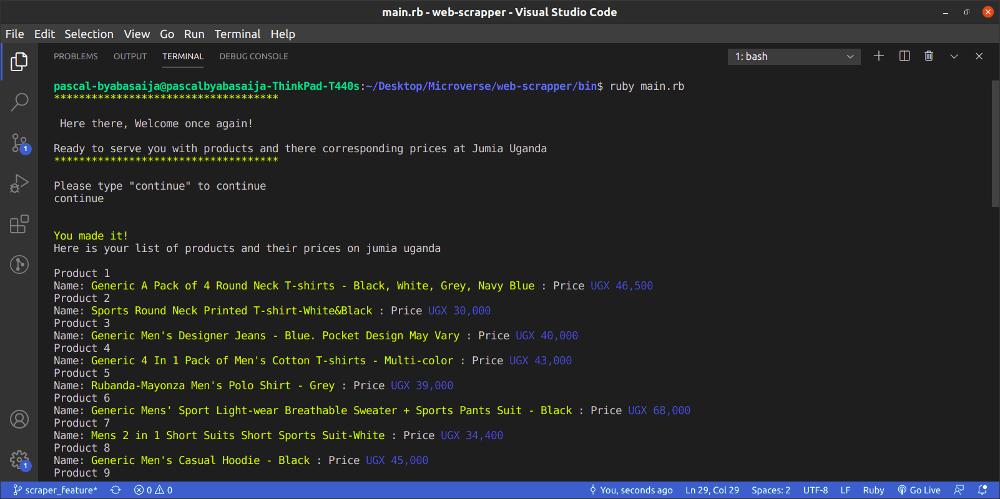

#  Ruby Capstone Project - Web Scraper
In this project, i created a web scraper that allows a user to access products and there corresponding prices from an online store [Jumia_uganda](https://www.jumia.ug/mlp-everything-for-him/men-clothing/) in the mens clothings section and display the results on the terminal.
 
I built this scraper with the aim of helping individuals  who spend a lot of time browsing products to know there prices.



## Getting Started

To get started, you should first get this file in your local machine by downloading this project or typing in your terminal
 
```git
git clone https://github.com/Byabasaija/web-scrapper.git
```

### Prerequisites

Before you start using the scraper, you need to be sure that you have Ruby installed on your computer, by typing.

```
ruby -v
```

You should see your version ofruby.

If it's not installed in your system, follow this [guide](https://www.ruby-lang.org/en/documentation/installation/) and it will help you to get it done.


## Running the Program 

You need to open your terminal and go to the downloaded folder, then You need to run the next command to install the gems.

```
bundle install
```

Then you can run the next command that starts the program.

```
ruby bin/main.rb
```

When the program starts, It is going to welcome you and ask you to type continue if you want to.

```
ruby rails
```
By default, the target of Scraper right now is the mens fashion clothing category, however you can change it to there categories by changing the url in scrape.rb file.

```
request = HTTParty.get("https://www.jumia.ug/mlp-everything-for-him/men-clothing/")
```

## Test-driven development RSPEC

The code includes unit testing using RSpec. To start the test run the next line in your terminal:

```
rspec
```

## Built With

* [Ruby](https://www.ruby-lang.org)


## Author

**Pascal Byabasaija**
- Linkedin: [Pascal Byabasaija](https://www.linkedin.com/in/pascal-byabasaija-80578814b/)
- Github: [@Byabasaija](https://github.com/Byabasaija)
- Twitter: [@byabashaijapoet](https://twitter.com/byabashaijapoet)


## Contributing

Contributions, issues, and feature requests are welcome!


## Show your support

Give a star if you like this project!

